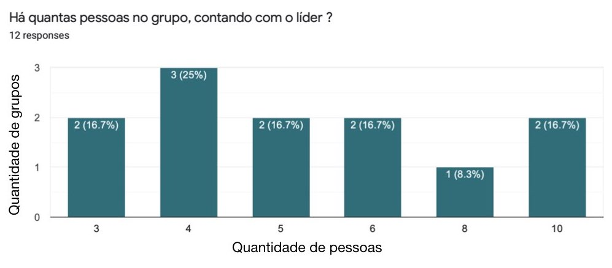
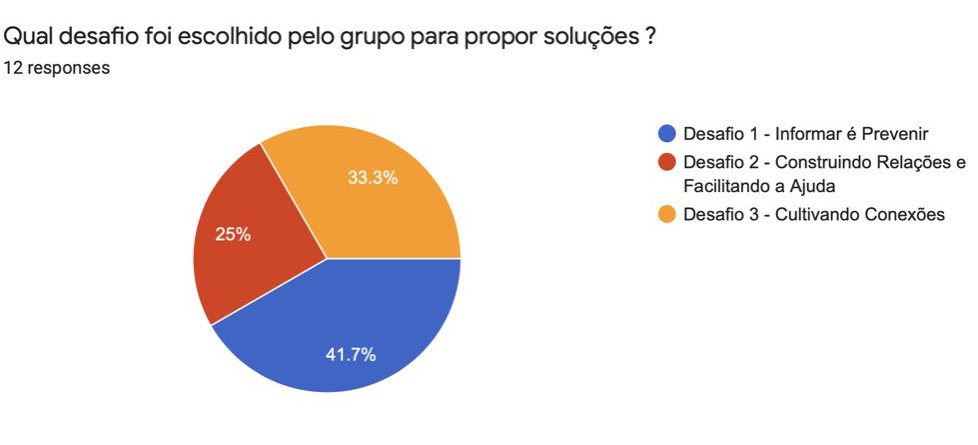

<h2 align="center">Sobre-o-Hackathon</h2>
<h4 align="center">Veja as principais informações para garantir a excelente participação da sua equipe no evento.</h4>

  <a href="#informações-básicas">Informações básicas</a>&nbsp;&nbsp;&nbsp;|&nbsp;&nbsp;&nbsp;
  <a href="#desafios">Desafios</a>&nbsp;&nbsp;&nbsp;|&nbsp;&nbsp;&nbsp;
  <a href="#resultados">Resultados</a>&nbsp;&nbsp;&nbsp;

# Hackathon UnB 2020 - soluções para enfrentar a COVID-19

É com grande alegria que é dada a largada desse Hackathon para que consigamos desenvolver incríveis soluções no contexto do isolamento social e do enfrentamento da COVID-19 no Distrito Federal e entorno !

Seja muito bem-vinda(o) !!!

## Informações básicas

- Esse repositório é apenas um meio de comunicação ;
- Esse documento que você está lendo agora pode sofrer alterações a qualquer momento !
 Portanto, **esteja sempre atento a esta página** ;
- **Leia o Regulamento do Hackathon !** ---> [clique aqui](./docs/Regulamento_Hackathon_UnB_FGA.pdf) ;
- Algumas informações à respeito do evento estarão disponíveis nas *issues* desse respositório, portanto **esteja atento** ;
- Quaisquer dúvidas, entre em contato com a Comissão Organizadora :
  - Instagram : @hackathonunbfga2020
  - Email : maratonadeprogramacaofga@gmail.com
  - Você também pode criar uma *issue* nesse repositório para tirar sua dúvida. Nesse caso, utilize a *label* "Dúvidas" na criação da *issue* .

  Veja abaixo como trabalhar com o repositório da sua equipe para desenvolver a solução.

## Sobre os repositórios nessa organização

⚠️ **O repositório só poderá ser utilizado quando for dada a largada da fase de desenvolvimento do Hackathon, no dia 15/05/2020, conforme previsto no [regulamento](./docs/Regulamento_Hackathon_UnB_FGA.pdf)**. ⚠️

- Cada repositório representa uma solução para um determinado desafio, com exceção do Sobre-o-Hackathon.

- O **líder de cada time**, feita a escolha de qual desafio irá cumprir (conforme o [regulamento](./docs/Regulamento_Hackathon_UnB_FGA.pdf)), deverá **responder ao formulário de formalização de equipes** ;

- A **Comissão Organizadora** criará o repositório público de cada equipe, seguindo o modelo abaixo, e **adicionará o líder de cada grupo como colaborador do repositório** ;

- Os repositórios das equipes serão criados da seguinte maneira :

  - ``Desafio-X-Grupo-Y``, 

      em que ``X`` representa o número do desafio escolhido (1, 2 ou 3) e  
      ``Y`` é o número do grupo, que é definido de acordo com a ordem das respostas do  formulário de formalização de equipes.

      > Exemplo: digamos que um time escolha o desafio 1 e que ele tenha sido o terceiro grupo 
       a responder o formulário mencionado. Então o nome do repositório será :  ``Desafio-1-Grupo-3``.
      
- **⚠️ ATENÇÃO ⚠️**
  - **O líder de cada time**, tendo sido adicionado ao repositório conforme descrito acima, 
   fica responsável por **adicionar os membros do grupo** dele como **colaboradores** do repositório, 
   sendo isso **parte fundamental para validar a participação de cada membro** no desenvolvimento da aplicação ;

- **⚠️ ATENÇÃO ⚠️**
  - Ao final do período do Hackathon UnB-FGA 2020, todos os times deverão apresentar, nos seus respectivos repositórios,
    um arquivo chamado **README.md**, parecido com este, no qual a equipe deverá explicar a solução proposta de
    maneira bem elaborada, conforme orientações que ainda serão divulgadas.

***

## Desafios

- Tema 1 : Informação e Saúde - 
 Desafio 1 : [Informar é Prevenir](./docs/Desafios/Desafio_1/Hackaton_FGA_2020_Desafio_1.pdf) ;

- Tema 2 : Cooperação Social - 
 Desafio 2 : [Construindo relações e facilitando a ajuda](./docs/Desafios/Desafio_2/Hackaton_FGA_2020_Desafio_2.pdf) ;

- Tema 3 : Agricultura e Alimentação - 
 Desafio 3 : [Cultivando Conexões](./docs/Desafios/Desafio_3/Hackathon_FGA_2020_Desafio_3.pdf) ;
  - Anexo importante : [Agricultura Familiar](./docs/Desafios/Desafio_3/Anexo_Agricultura_Familiar.pdf) .

***

## Resultados

O **Hackathon UnB-FGA 2020** tem a honra de apresentar os projetos vencedores :

### Desafio 1 - Informar é Prevenir
• Primeiro lugar : [Grupo 10 (CodInfo)](https://github.com/Hackathon-FGA-2020/Desafio-1-Grupo-10) 
• Segunda lugar : [Grupo 8 (Locovid)](https://github.com/Hackathon-FGA-2020/Desafio-1-Grupo-8) 
• Terceiro lugar : [Grupo 1 (Dubium)](https://github.com/Hackathon-FGA-2020/Desafio-1-Grupo-1) 
 
### Desafio 2 - Construindo relações e facilitando a ajuda
• Primeiro lugar : [Grupo 2 (Solidev)](https://github.com/Hackathon-FGA-2020/Desafio-2-Grupo-2) 
• Segundo lugar : [Grupo 5 (Ajuda aí)](https://github.com/Hackathon-FGA-2020/Desafio-2-Grupo-5) 
 
### Desafio 3 - Cultivando conexões
• Primeiro lugar : [Grupo 6 (AgroMart)](https://github.com/Hackathon-FGA-2020/Desafio-3-Grupo-6) 
• Segundo lugar : Empate entre [Grupo 3 (Nos Encontre)](https://github.com/Hackathon-FGA-2020/Desafio-3-Grupo-3) e [Grupo 4 (AgroShop)](https://github.com/Hackathon-FGA-2020/Desafio-3-Grupo-4) 

Parabéns a todos os participantes, eles fizeram a diferença nesses tempos de incertezas. 

Certeza que a maior vencedora disso é a sociedade! Pra cima ! 😁👏🏻🇧🇷

### Demonstrativos

| Desafio escolhido | Quantidade de pessoas | Quantidade de grupos |
|:-----------:|:--------:|:--------:|
| Desafio 1 | 28 | 5 |
| Desafio 2 | 15 | 3 |
| Desafio 3 | 25 | 4 |
| Total | 68 | 12 |

***

